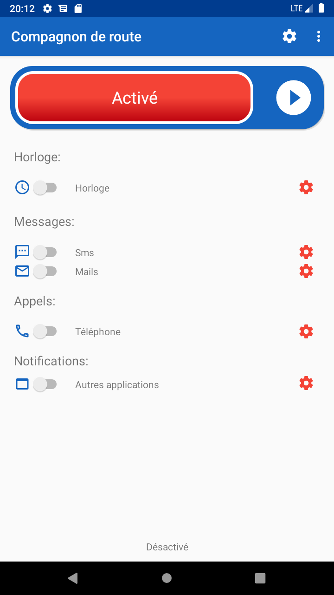
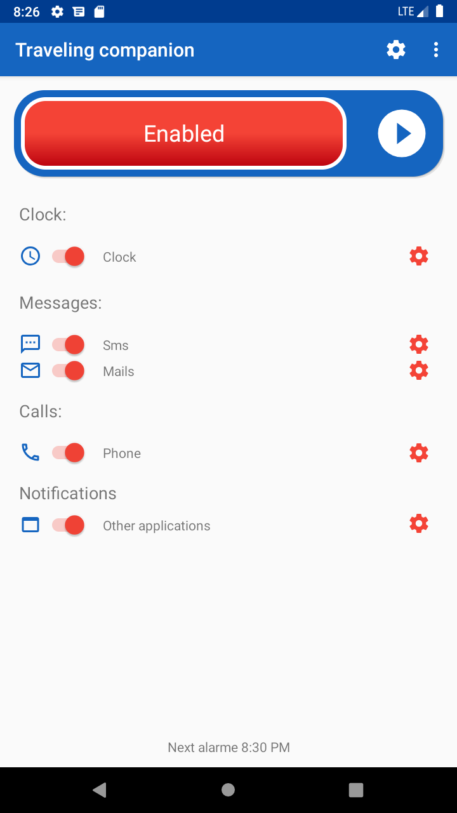

# CompagnonDeRoute
Android application that uses Vocal Synthesys to announce time and incoming message.
You get vocal notification for:
- hour
- incoming calls
- incoming sms
- notifications from all other application

I use this while riding my motorbike
### Installation

From Android Studio console, use the 'install-release.bat' batch file

## Startup

From your Android launcher

## Made with

* [Android Studio](https://developer.android.com/studio)

## Versions
**Last stable version :** 1.0

## Auteurs
Listez le(s) auteur(s) du projet ici !
* **Lucien Pilloni** lu1u [https://github.com/lu1u](https://github.com/lu1u)
